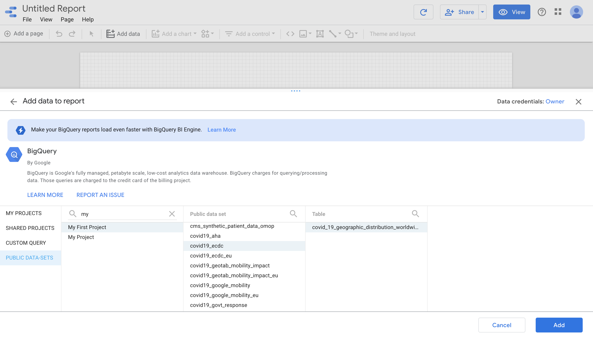
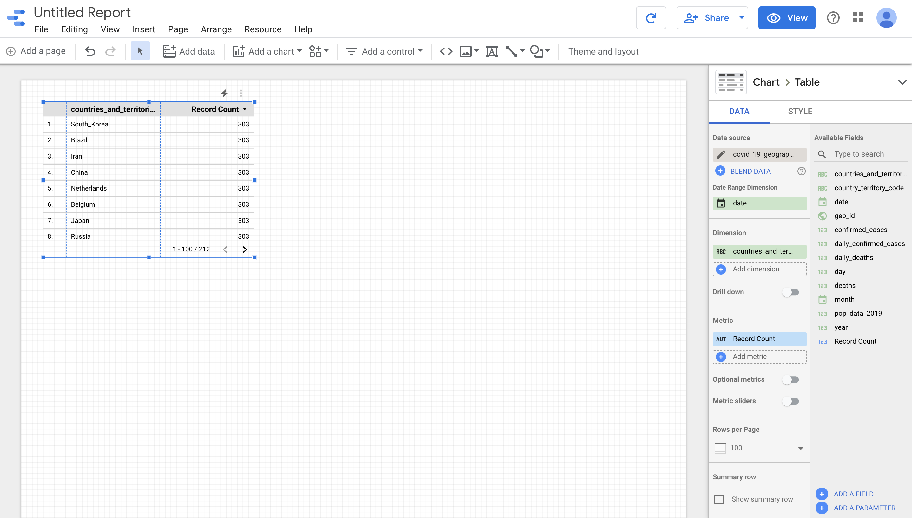
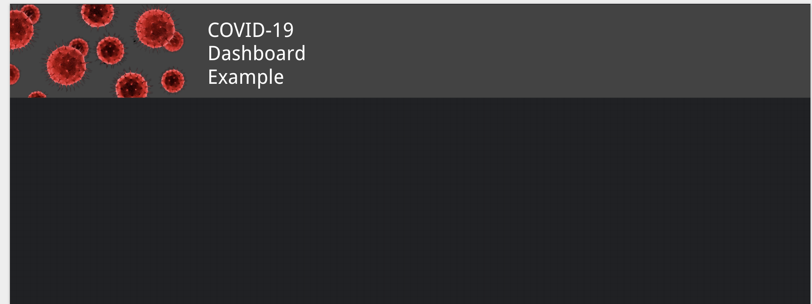
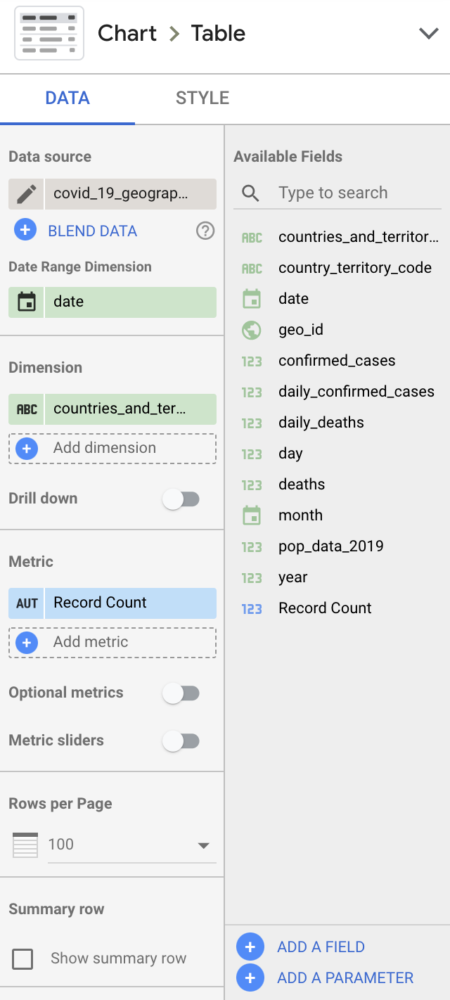

# Getting Started

## Requirements

* Google Account
* Google Cloud Platform account with a BigQuery project (free trial credits available)
* Database (can use public for tutorial purposes)

If you do not have a BigQuery project or want to use your own data. I have a blog post that goes through how you can set up one [here](https://ossinova.me/post/setup-bigquery/)

## Creating a DataStudio report

DataStudio is a very cool, free and suprisingly user-friendly tool built by Google. It allows for the creation of Dashboards and visualization by connecting a data source such as a CSV file or a database. In this tutorial we will be using BigQuery, another Google product that works very nicely in conjuntion with DataStudio.

Head over to [DataStudio](https://datastudio.google.com/) and log in with your Google account. Create a new empty report and select BigQuery as your connector. Make sure to select the right database and table that you wish to analyze. For the purposes of this tutorial I will use the COVID-19 public dataset.

This should create a report that should look like this:

You can delete the automatically generated table for now (backspace) once selected.

# Customizing the report

Like many other visualization and reporting tools (i.e Tableau, Power Bi and IBM Cognos) you can customize a DataStudio dashboard to your liking.

## Adding a theme

We can add a theme to our report by using one of the prebuilt ones or by customizing our own with different style options. For the simplicity of this tutorial I will select the prebuilt dark theme (Edge) from the **themes and layout panel**.   

## Adding a logo and title

To make the report a bit more personalized we can add a company logo and title. Tnis can be doen by adding a image and text field to the report. This can be found by selecting it in the toolbar:

A transparent logo is recommended for best result.

**Once completed the report should look something like this:**

## Adding charts

By clicking on the **Add a chart** dropdown button from the toolbar we can
add popular charts to our report.

Lets create a Table in our report. Since we already have connected BigQuery, DataStudio will suggest appropriate dimensions.

By clicking on the Table the sidepanel shows additional options for Data and Style. We can now edit the dimensions to our liking.

Lets leave the date range and dimension as it is. However, lets **use the fields; confirmed cases, daily confirmed cases and deaths for metrics.**

Lets also add a Geo chart to display confirmed cases in a more interactive way. Select the Geo chart from the toolbar and **add geo_id for the dimension and confirmed cases as the metric.**

You can add additional charts as you wish, in my case I also added some scorecards to visualize the total number of confirmed case, daily cases and deaths. A scorecard can also be found under the **add a chart** in the toolbar.

# Sharing the report

Once you get the hang off DataStudio and its features you can share the report with your co-workers, friends, or clients. There are multiple options in terms of sharing. The easiest option is to share through a link, or by inviting the person to the document and giving them view access.

Another handy sharing option is to embed the report. Embedding allows you to share the report to your website or web application. This allows for more customization and can easily be integrated into a portal,  admin panel or statistics page.

Below you can se my finalized report embedded into my blog.

<iframe width="600" height="450" src="https://datastudio.google.com/embed/reporting/2b391029-9875-499a-ab3f-ad99104194e8/page/MsGmB" frameborder="0" style="border:0" allowfullscreen></iframe>

# Rounding things off

In this short tutorial I went through how you can use DataStudio to visualize your data with the BigQuery connector. How you can add a theme and style your report. How you can customize charts and maps as well as how to share your finalized results.

There are a lot more you can do with DataStudio. Such as adding more pages, filtering options and community charts. However, I advice you to play around and try these features on your won. If you have any questions you can contact me on [LinkedIn](https://linkedin.com/in/oscar-dyremyhr/)
